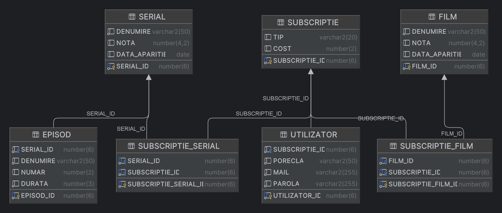

# Netflix-Java-Application
 
## Quick Description

This is a copy of the Netflix application. You can expect to do the same 
actions as on the official app. For example: A user can create an account, 
he can also enter a subscription model, which will provide different movies
or tv series he can watch. 

## Model Documentation
Visit the [Model Documentation Website](https://netflix-java-applicaton.web.app/) for detailed information about the models
used in this project.

## Database Diagram

> The image above illustrates the database structure used in this project.

